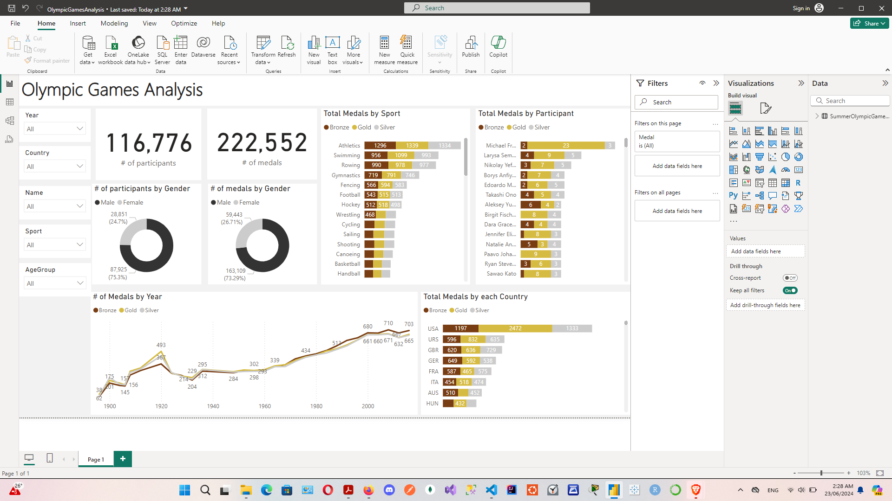

# Olympic games Analysis 


# Objective 

Finding out how many winners and participants competed in the Olympics from Athens 1896 to Rio 2016

# Data source 

The dataset [click here to find it.](https://www.kaggle.com/datasets/heesoo37/120-years-of-olympic-history-athletes-and-results?select=athlete_events.csv) or [here](https://github.com/aliahmad-1987/DataAnalystProject_SQL_PBI_OlympicGamesAnalysis/blob/main/Episode%201%20-%20Link%20To%20Olympic%20Games%20Data.txt) 


There are two datasets
- Athletic event and result for each participant
- National Olympic Committee (NOC) code for each Region


# ETL

## Steps

1. Load the data into SQL Server
2. Clean and transform the data with SQL
3. Visualize the data in Power BI

### Transform the data 

After loading the data into SQL Server, start the transformation process


```sql
/*
1. Write full gender name
2. Create different age groups
3. Split the games Column into year and Season
4. Replace NA with No Medal
5. Filter data to keep only Summer games
*/

SELECT
ID,
Name,
CASE
	WHEN Sex = 'M' THEN 'Male'
	ELSE 'Female'
END as Gender,
Age,
CASE
	WHEN Age < 18 THEN 'Under 18'
	WHEN Age BETWEEN 18 AND 25 THEN '18-25'
	WHEN Age BETWEEN 25 AND 30 THEN '25-30'
	WHEN Age BETWEEN 30 AND 35 THEN '30-35'
	WHEN Age > 35 THEN 'Over 35'
END as AgeGroup,
Height,
Weight,
ar.NOC,
nr.region AS Country,
PARSENAME(REPLACE(Games, ' ', '.'), 2) as Year,
PARSENAME(REPLACE(Games, ' ', '.'), 1) as Season,
City,
Sport,
Event,
CASE WHEN Medal = 'NA' THEN 'No Medal' ELSE Medal END as Medal
FROM athletes_event_results ar
JOIN noc_regions nr ON ar.NOC = nr.NOC
WHERE PARSENAME(REPLACE(Games, ' ', '.'), 1) = 'Summer'
```


# Visualization

- What does the dashboard look like?

